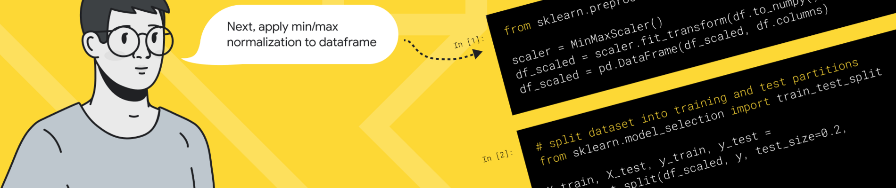

# Source code of Google AI4Code competition(9th on LB, <unk&gt; on PB)

The source code of Kaggle's [Google AI4Code – Understand Code in Python Notebooks](https://www.kaggle.com/competitions/AI4Code) competition.

## 🧪 Solution

Kaggle | GitHub | 中文(知乎)

## 🐳 Main software/libs been used

* Python==3.7
* torch==1.11.0+cu113
* transformers==4.18.0
* pytorch-ignite==0.4.9

## 🐌 Training

> I didn't test it from scratch, but it should be easy to setup by just changing some path related variables. Feel free to fire issues.

1. Download dataset and pretrain models

Download dataset from Kaggle

```bash
kaggle competitions download -c AI4Code
```

Download pretrain model from Hugging Face

```bash
git lfs install
git clone https://huggingface.co/microsoft/deberta-v3-small
```

2. Pre tokenize all the dataset

I do not tokenize the text on the fly cause it will slow down the training speed and cost a lot of more memories.

```bash
python scripts/prepare.py --processor v8 --suffix v8_deberta_small --pretrained_tokenizer /home/featurize/deberta-v3-small
```

3. Train

With the following training options, the model trained should be easy to reach like ~0.87 on both CV and LB.

```bash
torchrun --nproc_per_node gpu train.py \
    --pretrained_path {path of deberta-v3-small pretrain path} \
    --code baseline \
    --override \
    --lr 0.00002 \
    --max_epochs 2 \
    --batch_size 50 \
    --optimizer Adam \
    --anchor_size 96,160 \
    --val_anchor_size 128 \
    --accumulation_steps 4 \
    --max_len 384 \
    --split_len 16 \
    --dataset_suffix v8_deberta_small \
    --num_workers 0 \
    --pair_lm \
    --evaluate_every 10000 \
    --val_folds \
    --train_folds v8_deberta_small/0.pkl \
v8_deberta_small/1.pkl,\
v8_deberta_small/2.pkl,\
v8_deberta_small/3.pkl,\
v8_deberta_small/4.pkl,\
v8_deberta_small/5.pkl,\
v8_deberta_small/6.pkl,\
v8_deberta_small/7.pkl,\
v8_deberta_small/8.pkl,\
v8_deberta_small/9.pkl
```


