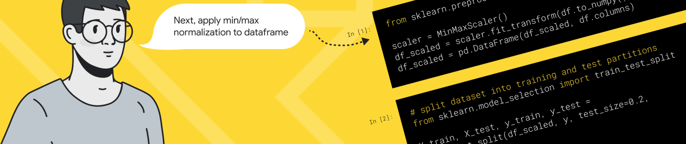
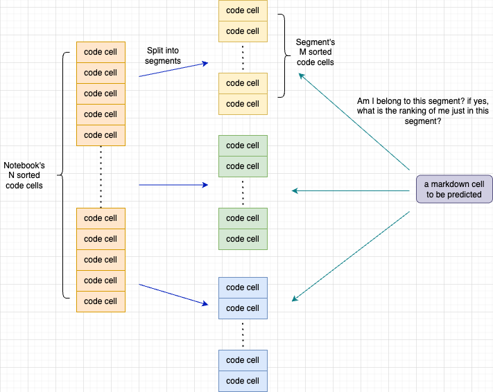
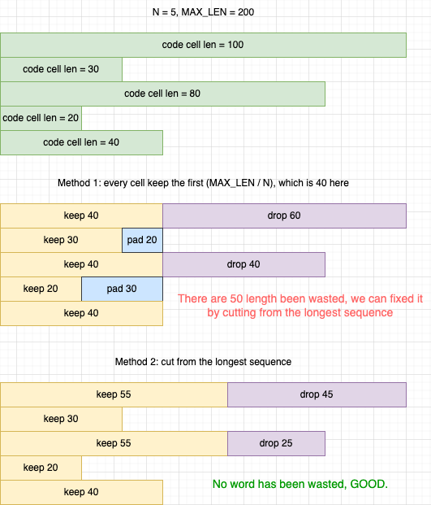

# Segment Ranking(9th on LB, <unk&gt; on PB)

Source code: https://github.com/louis-she/ai4code.git

Inference Notebook: https://www.kaggle.com/code/snaker/new-rank/notebook

## TL;DR

One deberta-v3-small model is enough, ranking method, subsequences(segment).

My solution only uses the ranking method. Given a markdown cell and a bunch of sorted code cells, predict the position of the markdown cell. The main difference here is that I do not use a whole notebook to rank a markdown cell, but just a part of it, which can be called a `segment`.

For instance, given a notebook of 40 code cells, we can divide it into 4 sub segments, each segment containing 10 code cells. Then we rank each markdown of the whole notebook in the 10 code cells.

Interesting thoughts about this method, if we divided the 40 code cells into 40 segments, each segment contains only 1 code cell, then this method is the same as Pairwise, if do not divide the notebook(or divide it into 1 segment), then it's same as full ranking.

## Segment Ranking

The full ranking method, which is also open sourced [here](https://www.kaggle.com/competitions/AI4Code/discussion/326970), is to predict a markdown cell's position in the whole code cells. The sequence feed to the model is usually like this: <markdown_cell&gt; + <code_cell&gt; + <code_cell&gt; ... <code_cell&gt;, but many of the sequence is way too long for transformer models(even for longformer), one simple method to handle the long sequence issue is to cut off the length of makdown_cell and code_cell to make the ensembled sequence length is acceptable. But the more cut-off, the more information we lose, so how can we keep the information as much as we can and also get a reasonable output sequence length?

To address the global information and sequence length balance issue, I came up with the Segment Ranking method.

A segment is part of a notebook's sorted code cells. If using M for the number of code cells in a notebook, and N for the number of code cells in a segment, then a notebook can be divided into C segments, in which C equals `math.ceil(M / N)`.

Now since we have multiple segments of a notebook, and markdown cells in that notebook can only belong to one of the segments, we have to first decide if a markdown belongs to a segment, and then do the ranking in that segment. So there are two heads of the model, one for classification and one for ranking. The following figure demonstrates the details.

The number of cell in segments(N) here is a super important hyperparameter. A large N will speed up training and inference, small N can bring more context information. I ended up choosing N = 16 and sequence max length = 384.

## Other important Task-related tricks

**Training with language modeling**

There is actually the third head of my model, which is used as language modeling. The input for that head is <previous_cell_encode&gt; + <anchor_cell_encode&gt; + <next_cell_encode&gt;, positive means that the three is continuous, negative means not continuous, they are just randomly pick from the notebook(but not the previous and next ones).

**<pad&gt; is a wast**

I try to keep as much information as possible and reduce <pad> tokens. Given the following markdown cell and code cells, how can we cut off to keep a length of 384? Instead cut every cell at a fixed length, I used the following method showed by the figure. Or have a look at the [test case](https://github.com/louis-she/ai4code/blob/master/tests/test_utils.py#L6).

